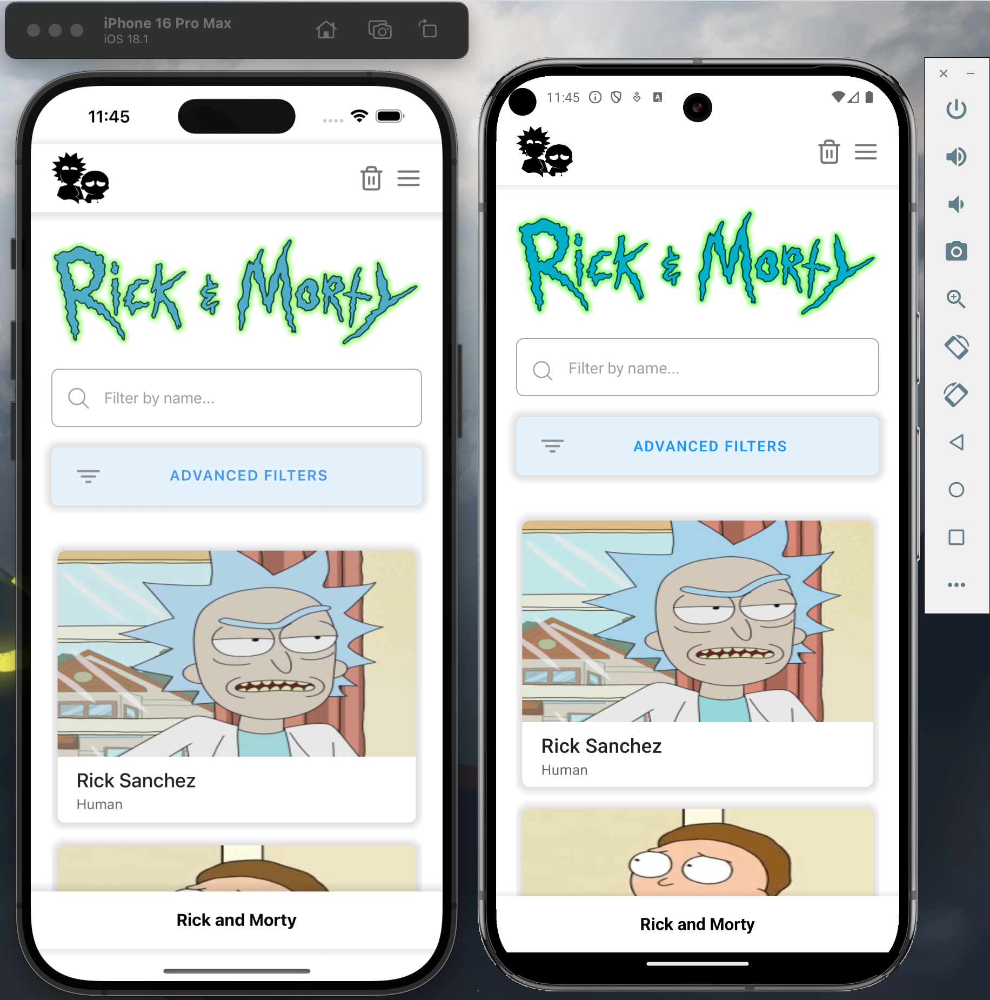
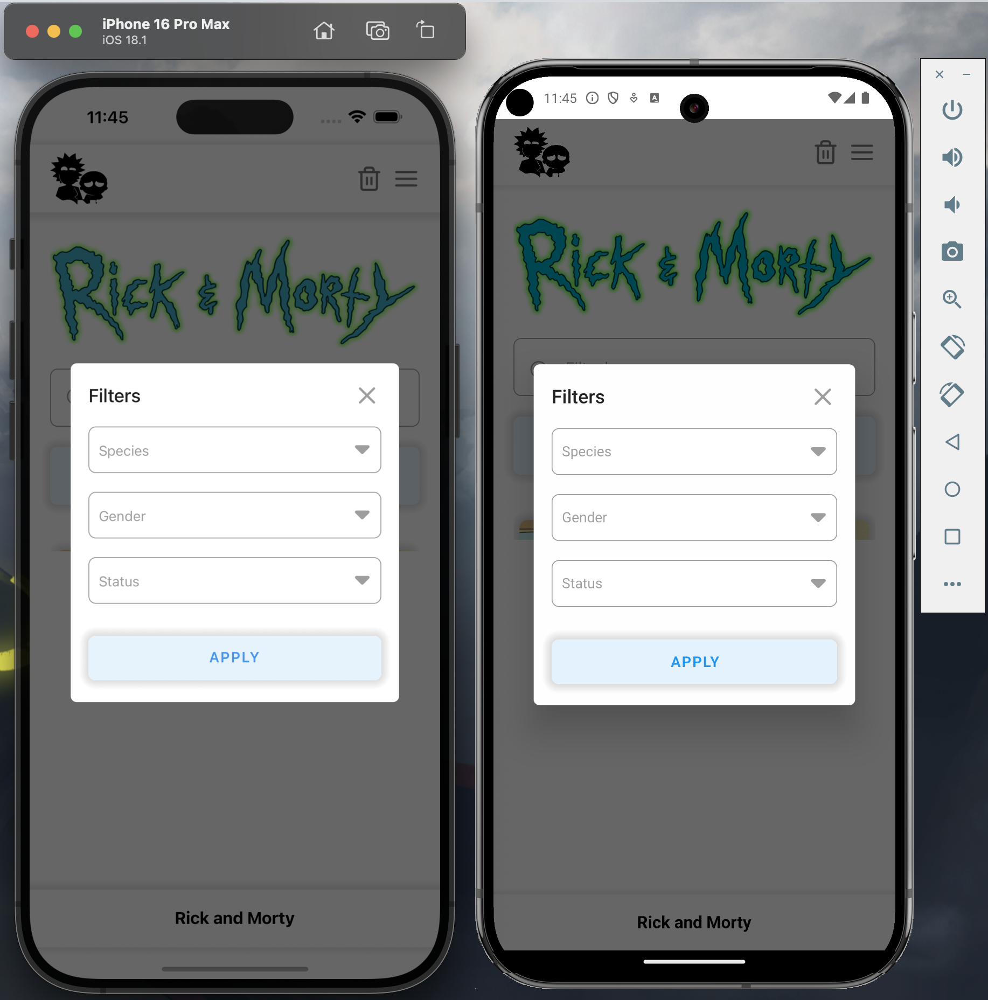
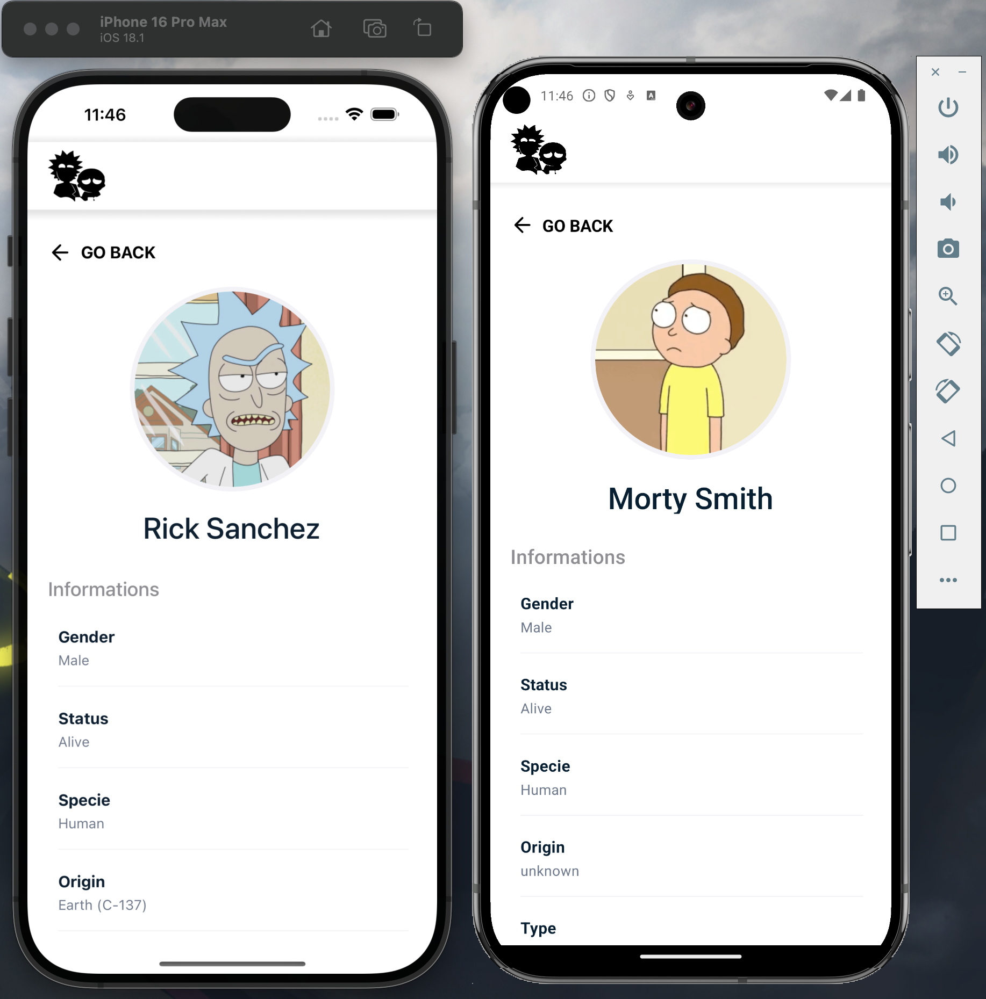

# GuarapoLabTechnicalTest

Inspired by the Rick and Morty API, this app seeks to list, filter and display the details of all the characters of the series that have been released to date.

# Setup Enviroment

Project created with React Native CLI.[ See official docs](https://reactnative.dev/docs/environment-setup) to set up the environment.

### Run

**Install dependencies**
```bash
npm i
```
**Install IOS Pods**
cd ios to navigate to the ios folder.
```
 install Bundler
bundle exec pod install
```

 to install the iOS dependencies managed by CocoaPods.

**Run project**

```bash
npm start
```

**Run IOS**

```bash
npm run ios
```

**Run Android**

```bash
npm run android
```

### 🛠 Tech and Libraries

- [React Native](https://reactnative.dev/) Library js
- [TypeScript](https://www.typescriptlang.org/)Application typing stronger
- [React Navigation](https://reactnavigation.org/): Routing and navigation
- [React Hook Form](https://react-hook-form.com/get-started): Build scalable and performant forms
- [Axios](https://github.com/axios/axios): Promise based HTTP client
- [Zustand](https://redux-toolkit.js.org/Í): Data storage more  efficient and easy to handler than Redux or Redux Toolkit


# Link-video-demo-app

[](https://www.youtube.com/watch?v=5uhDERSZBBM)

### App Screenshots


|                                 |                                     Mobile                                  |
| :------------------------------:| :--------------------------------------------------------------------------:|
|               Screen 1          |                                             |
|               Screen 2          |                                             |
|               Screen 3          |                                             |


# Command tree for the files

```bash
.
├── App.tsx
├── Gemfile
├── Gemfile.lock
├── README.md
├── app.json
├── babel.config.js
├── gesture-handler.js
├── gesture-handler.native.js
├── global.d.ts
├── index.js
├── jest.config.js
├── metro.config.js
├── package-lock.json
├── package.json
├── setupTests.js
├── src
│   ├── assets
│   │   └── imgs
│   │       ├── fullLogo.webp
│   │       ├── fullLogo@2x.webp
│   │       ├── fullLogo@3x.webp
│   │       ├── loading.webp
│   │       ├── loading@2x.webp
│   │       ├── loading@3x.webp
│   │       ├── logo.webp
│   │       ├── logo@2x.webp
│   │       └── logo@3x.webp
│   ├── components
│   │   ├── BrandWrapper.tsx
│   │   ├── ButtonGeneric.tsx
│   │   ├── CharacterCard.tsx
│   │   ├── CustomImage.tsx
│   │   ├── Footer.tsx
│   │   ├── InfoDetail.tsx
│   │   ├── ModalFilters.tsx
│   │   ├── StandardWrapper.tsx
│   │   ├── index.ts
│   │   └── inputs
│   │       ├── InputGeneric.tsx
│   │       ├── SelectorGeneric.tsx
│   │       └── index.ts
│   ├── hooks
│   │   ├── index.ts
│   │   ├── useCharacters.ts
│   │   ├── useDebouncedValue.ts
│   │   ├── useFilterForm.ts
│   │   ├── useFilterSelectors.ts
│   │   └── useSingleCharacter.ts
│   ├── index.ts
│   ├── interfaces
│   │   ├── button.ts
│   │   ├── chartersRes.ts
│   │   ├── customImage.ts
│   │   ├── episode.ts
│   │   ├── filterCharacter.ts
│   │   ├── index.ts
│   │   ├── inputs.ts
│   │   └── navigation.ts
│   ├── navigation
│   │   ├── MainNavigation.tsx
│   │   └── index.ts
│   ├── screens
│   │   ├── Details.tsx
│   │   ├── Home.tsx
│   │   └── index.ts
│   ├── services
│   │   ├── api.ts
│   │   └── index.ts
│   ├── store
│   │   ├── __test__
│   │   │   └── characters.test.ts
│   │   ├── characters.ts
│   │   ├── index.ts
│   │   ├── interfaces
│   │   │   ├── characters.ts
│   │   │   ├── index.ts
│   │   │   └── settings.ts
│   │   └── settings.ts
│   ├── test
│   │   ├── index.ts
│   │   ├── mocks
│   │   │   ├── charactersMock.ts
│   │   │   ├── charactersStoreMock.ts
│   │   │   ├── index.ts
│   │   │   ├── mockRickAndMortyApi.ts
│   │   │   └── zustand.ts
│   │   └── test-env.tsx
│   └── utils
│       ├── buildQueryParams.ts
│       ├── const
│       │   ├── enumsFilters.ts
│       │   ├── index.ts
│       │   ├── phoneDimensions.ts
│       │   └── sourceImgs.ts
│       ├── enumToSelectItems.ts
│       ├── index.ts
│       └── isIOS.ts
├── tsconfig.json
└── tsconfig.test.json
```